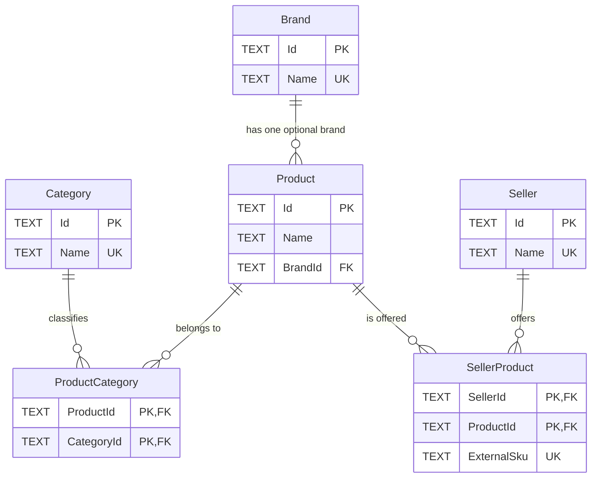

# Specification — data profile

Profile of the published inputs and the shape of the refactored database. Numbers are a
snapshot; the remote content may change.

## Base catalog as given (`catalog.db`)

```sql
CREATE TABLE Product (
    Id INTEGER PRIMARY KEY AUTOINCREMENT,
    Name TEXT NOT NULL,
    Brand TEXT,
    Category TEXT
);

CREATE TABLE SellerProduct (
    Id INTEGER PRIMARY KEY AUTOINCREMENT,
    SellerName TEXT NOT NULL,
    ProductId INTEGER NOT NULL CONSTRAINT FK_Product_Id REFERENCES Product (Id),
    SellerProductId INTEGER NOT NULL
);
```

- `Product`: **975 rows**. `Name` is **unique after normalization** (zero collisions) —
  an exact normalized-name lookup returns at most one product.
  - `Brand`: **119 rows** null. **639** distinct raw strings; **637** after normalization
    — the 2 that merge: `BLACK+DECKER` / `Black+Decker` and `Simplehuman` / `simplehuman`.
  - `Category`: **34 rows** null. **43** distinct strings; **43** after normalization
    (no merges).
- `SellerProduct`: **0 rows**. No index, no uniqueness constraint.

Why this model is compromised, the design decisions, and the accepted risks are in
[`prd.md`](../prd.md#database-refactor). This file is the **single source of truth for
the schema and the migration**; other documents reference this section rather than
restating it.

## Refactored database

Before any feed processing, the downloaded copy is refactored — both given tables
dropped and recreated, three reference tables (`Brand`, `Category`, `Seller`) added.
The schema and every statement use SQLAlchemy Core (declarative `Table` metadata + DDL
+ `insert()`; no ORM); the refactor itself is a single Alembic revision (`0001`) run
programmatically with the import connection injected, so it executes inside the setup
transaction. Every primary key is a `uuid4` stored as `TEXT`, minted in Python;
no `AUTOINCREMENT`.

### Conditional migration

Keyed on Alembic's `alembic_version` table, so the tool can also run against a database
it has already produced. `consolidation._refactor.classify_source` inspects the table
shape first and rejects an unrecognized schema before Alembic is invoked.

| Detected source | Classified as | Action |
| --- | --- | --- |
| legacy tables present: `Product` with integer `Id` + `Brand` + `Category` columns, `SellerProduct` with `SellerName` + `SellerProductId`; no `Brand`/`Category`/`Seller`/`alembic_version` tables | legacy | `alembic upgrade head` runs revision `0001` (the migration steps) and stamps `alembic_version = 0001` |
| target tables present (`Brand`, `Category`, `ProductCategory`, `Seller`; `Product.Id` is `TEXT`; `SellerProduct` has `ExternalSku`) **and** `alembic_version` at `0001` | already migrated | `alembic upgrade head` is a no-op |
| neither | unrecognized | abort before any write, non-zero exit |

The published `catalog.db` is always legacy. Re-running against a previous output
(already at `0001`) re-applies the feed with idempotent writes and is a no-op when the
feed is unchanged.

### Target schema

```sql
CREATE TABLE Brand (
    Id   TEXT PRIMARY KEY,                -- uuid4
    Name TEXT NOT NULL UNIQUE             -- capitalized normalized brand name
);

CREATE TABLE Category (
    Id   TEXT PRIMARY KEY,                -- uuid4
    Name TEXT NOT NULL UNIQUE             -- capitalized normalized category name
);

CREATE TABLE Product (
    Id      TEXT PRIMARY KEY,             -- uuid4
    Name    TEXT NOT NULL,
    BrandId TEXT REFERENCES Brand (Id)    -- nullable (119 base rows)
);

CREATE TABLE ProductCategory (            -- product taxonomy memberships
    ProductId  TEXT NOT NULL REFERENCES Product (Id),
    CategoryId TEXT NOT NULL REFERENCES Category (Id),
    PRIMARY KEY (ProductId, CategoryId)
);

CREATE TABLE Seller (
    Id   TEXT PRIMARY KEY,                -- uuid4
    Name TEXT NOT NULL UNIQUE
);

CREATE TABLE SellerProduct (             -- many-to-many link + the seller's own id
    SellerId    TEXT NOT NULL REFERENCES Seller (Id),
    ProductId   TEXT NOT NULL REFERENCES Product (Id),
    ExternalSku TEXT NOT NULL,            -- the feed entry's Id (opaque)
    PRIMARY KEY (SellerId, ProductId),
    UNIQUE (SellerId, ExternalSku)
);
```

`Brand` is a reference table with a nullable 0..1 FK on `Product`. `Category` is a
reference table connected through `ProductCategory`, allowing a product to belong to
multiple categories. `SellerProduct` is a junction because a product genuinely has
many sellers.

#### Target schema diagram



### Kept / replaced / deleted

- **`Product`** — dropped and recreated. `Name` carried over for all 975 rows; `Id`
  becomes a fresh `uuid4` (old integer id discarded); `Brand` text is replaced by the
  nullable `BrandId` FK and `Category` text is replaced by `ProductCategory` memberships
  (119 brand-less rows; 34 products have no category membership).
- **`ProductCategory`** — created as a product/category junction with a composite
  primary key; each legacy non-null `Product.Category` becomes one membership.
- **`SellerProduct`** — dropped and recreated: `Id` removed, `SellerName` → `Seller`,
  `SellerProductId INTEGER` → `ExternalSku TEXT`, `ProductId` becomes a UUID FK; new
  composite PK and `UNIQUE (SellerId, ExternalSku)`.
- **`Brand`**, **`Category`**, **`Seller`** — created with UUID PKs.

### Migration steps

Revision `0001` (`migrations/versions/0001_refactor_catalog.py`) delegates to the
helpers in `consolidation._refactor`. Staged tables are built alongside the originals
then swapped in. FK enforcement remains off during the rebuild because SQLite's
`PRAGMA foreign_keys` is a no-op inside a transaction; `PRAGMA foreign_key_check`
validates the result at the end. After the setup commits, `CatalogRepository` enables
and verifies FK enforcement before consuming the feed, including for already-migrated
sources. Normalization and every `uuid4` are computed in Python, so each extraction
reads distinct values and builds an in-memory map (not a pure `INSERT ... SELECT`).

1. **staging tables**: create `Brand`, `Category`, `Seller`, `Product_new`,
   `ProductCategory_new`, `SellerProduct_new`.
2. **`Product.Brand` → `Brand`**: `(uuid4(), normalized_name.title())` per distinct
   normalized non-empty brand (**637** rows); keep `{normalized_brand: id}`.
3. **`Product.Category` → `Category`**: same (**43** rows), with a title-cased persisted
   name; keep `{normalized_category: id}`.
4. **`Product` rebuild**: fill `Product_new`; per old row `(uuid4(), Name,
   brand_map.get(...))`; keep `{old_int_id: new_uuid}` and insert one
   `ProductCategory_new` membership when the legacy category is non-null.
5. **`SellerProduct` rebuild**: extract `SellerName` → `Seller` (`(uuid4(), name)` per
   distinct name), then fill `SellerProduct_new` from each old row remapped through the
   seller and product maps, `str(SellerProductId)` → `ExternalSku`. Base table empty →
   0 rows in both.

   For legacy exports that also include a `Product.Seller` column, the migration copies
   each distinct non-empty value into `Seller.Name` before rebuilding `SellerProduct`.
   The published snapshot has no such column, so its sellers come from
   `SellerProduct.SellerName`.
6. `DROP` the two old tables; rename `Product_new` / `SellerProduct_new` into place;
   clear the residual `sqlite_sequence` counters.
7. `PRAGMA foreign_key_check` (must be empty). Alembic stamps `alembic_version = 0001`.

The whole revision is skipped for an already-migrated source. WAL is not used; the
output is a self-contained database written after the engine is disposed.

## Seller feed (`ProductEntry.json`)

- **269 entries**. Every entry has all five keys: `Id`, `SellerName`, `Name`, `Brand`,
  `Category`.
- `Brand` is `null` in 3 entries (`Cable Organizer Kit`, `Bed Frame Wood King`,
  `Round Rug 6 Feet`). `Category` always present (28 distinct normalized values; `photo`
  is the only one not in the catalog). `Name`, `SellerName` never empty.
- **20** distinct seller names.
- `Id`: 255 distinct of 269.
  - **3 are not valid UUIDs**: `ddddeee-ffff-4000-1111-222233334444` (7-char group),
    `09835342345-4678-9abc-def012345678` (4 groups, oversized first),
    `uddd0000-eeee-4111-ffff-aaaa22223333` (`u` is not hex).
  - **14 `Id` strings are reused**, always across *different* sellers — so
    `UNIQUE (SellerId, ExternalSku)` is never violated, and `Id` cannot identify a
    product.
  - `Id` is kept as `SellerProduct.ExternalSku`, opaque text.
- **1 `(SellerName, Id)` pair repeats**: `GardenStore`, same `Id`, once
  `"Câmera Canon EOS R6"` and once `"Camera Canon EOS R6"` — both resolve to the same
  product, so one link.

## Match outcomes (with the shipped rules)

Screening → normalization → exact name → same word multiset → gated fuzzy.

| Outcome | Count |
| --- | --- |
| Rejected by the SQL injection screen (`threat`) | 1 |
| Resolves to exactly one catalog product (exact normalized name) | 266 |
| Resolves by the same normalized words in a different order | 0 |
| Resolves via one gated fuzzy candidate | 2 |
| No match, new product | 0 (the only candidate is the threat) |
| Ambiguous / brand conflict (`skipped`) | 0 |

The 3 entries without an exact normalized-name match:

| Feed name | Nearest catalog name | `difflib.ratio` | Decision |
| --- | --- | --- | --- |
| `Roteador WiFi 6 TP-Link` | `Router WiFi 6 TP-Link` | **0.909** | fuzzy match (passes the 0.90 gate) |
| `Processador AMD Ryzen 9 7950X` | `Processor AMD Ryzen 9 7950X` | **0.964** | fuzzy match |
| `Security Test Product` | `Security Camera Nest` | 0.585 | would be new — but rejected as a threat |

`rapidfuzz.fuzz.ratio` uses the same `2M/T` formula as `difflib.ratio` and also yields
`0.909` for `Roteador/Router`; the shared `0.90` threshold holds for both backends.

## Field-level ambiguities observed

The full list with the decision taken for each class is the
[ambiguity register in `prd.md`](../prd.md#ambiguity-register-every-class-occurs-in-the-real-data).
Data specifics found here:

- **Whitespace**: 60 feed entries contain a double space (`"Smartphone  Galaxy S23"`).
- **Brand spelling**: catalog `BLACK+DECKER` vs `Black+Decker` and `Simplehuman` vs
  `simplehuman` (merge on normalization); feed `"Levi's"` vs catalog `"Levis"`.
- **Category disagreement**: `Camera Canon EOS R6` — `Photography` in the catalog,
  `Photo` in the feed → two category memberships for the same product.
- **SQL injection probe**: the `MegaStore` / `"Security Test Product"` entry has
  `Brand = "TestBrand'; SELECT 1; --"` and one of the malformed `Id`s. `libinjection`
  flags the brand (rejected, `threat`) but does **not** flag `"Levi's"` or `12.9''`.

## Resulting row counts

| Table | Rows | Note |
| --- | --- | --- |
| `Brand` | **637** | distinct normalized catalog brands; no new brands (the one new-product candidate is a threat) |
| `Category` | **44** | 43 normalized catalog categories plus the feed-only `Photo` category |
| `Product` | **975** | same count, rebuilt with fresh `uuid4` ids; `Brand` replaced by `BrandId`; 119 rows `BrandId IS NULL` |
| `ProductCategory` | **942** | 941 migrated memberships plus the feed-only `Photo` membership; 34 products remain without a category |
| `Seller` | **20** | distinct feed seller names |
| `SellerProduct` | **256** | distinct `(SellerId, ProductId)`; 12 feed entries collapse onto an existing pair (11 log `duplicate_listing`), 1 entry is a threat |

Local SQLite build note: `spellfix1` is unavailable; FTS5 and the trigram tokenizer are
present. Indexed candidate reduction is out of scope regardless.
